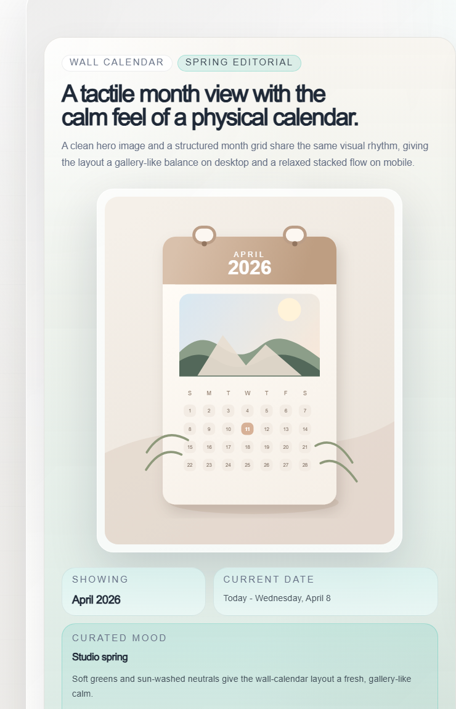
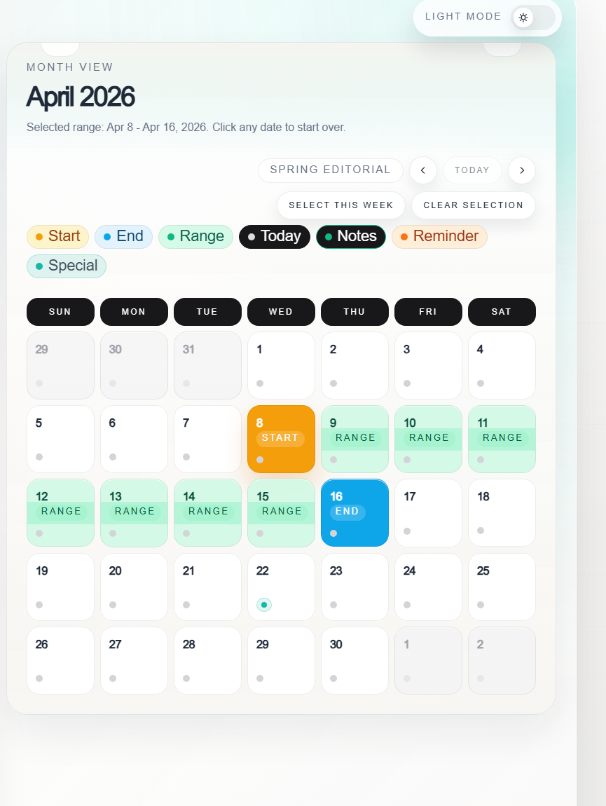
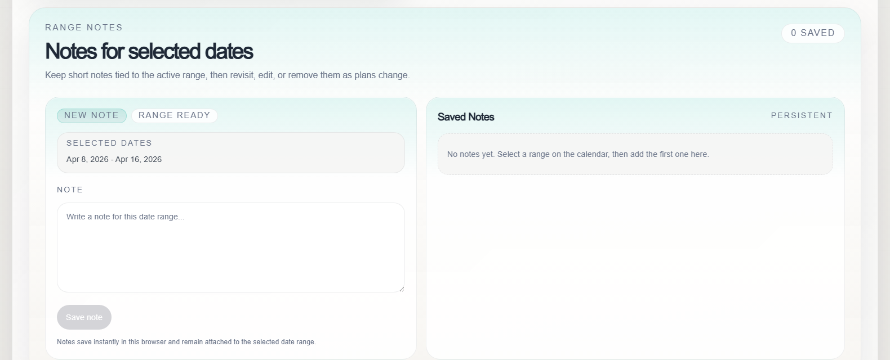
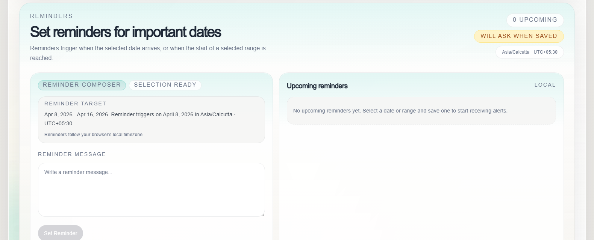

# Interactive Wall Calendar Component

## Frontend Engineering Challenge Report

This project began as a frontend engineering challenge to build an interactive wall calendar component.  
It has been expanded into a polished product-style interface with stronger interaction design, accessibility support, responsive behavior, reminders, note-taking, and production-minded UI refinement.

## Project Overview

The final build focuses on making a calendar feel useful in a real product, not just visually complete.  
The interface combines a wall-calendar-inspired hero section, a tactile month view, persistent notes, reminder workflows, quick actions, keyboard accessibility, adaptive theming, and smooth motion.

## Interface Preview

### Hero Section

Wall-calendar-inspired hero composition with editorial styling, dynamic seasonal accenting, and responsive introductory content.

### Month View

Month grid with highlighted date range, quick actions, and clear visual markers for selection states and important dates.

### Notes Workflow

Integrated notes composer and saved-notes panel tied directly to the currently selected date range.

### Reminders Workflow

Reminder setup with timezone-aware targeting, notification status, and upcoming-reminders visibility.

## Implemented Features

### Core Experience

- Wall calendar layout with a hero image and premium split composition
- Month-view calendar grid with a 7-column layout
- Current month display with highlighted current day
- Responsive layout for desktop, tablet, and mobile devices

### Calendar Interaction

- Click-based date range selection
- Drag-to-select date range interaction
- Clear start, end, and in-range highlighting
- Quick actions for `Today`, `Clear Selection`, `Select This Week`, `Previous Month`, and `Next Month`
- Smooth animated month transitions

### Notes System

- Add notes for a selected date or date range
- Edit and delete notes
- `localStorage` persistence for saved notes
- Notes indicators shown directly on calendar dates
- Full-width notes section for easier review and editing

### Reminders and Notifications

- Set reminders for a selected date or range
- Add custom reminder messages
- Browser Notifications API support
- In-app alert fallback when notification permission is denied
- Upcoming reminders list
- Timezone-aware reminder labeling and scheduling

### Visual and UX Enhancements

- Light and dark mode with saved preference
- Dynamic accent styling influenced by the hero image
- Framer Motion animations for load, selection, panel transitions, and month changes
- Premium hover, focus, and feedback states
- Toast feedback for actions like saving notes and reminders
- Sticky and contextual layout improvements to reduce friction while using the calendar

### Accessibility and Robustness

- Keyboard navigation with arrow-key support in the calendar grid
- Enter and Space support for date selection
- Visible focus states for interactive elements
- Screen-reader-friendly labels and summaries
- Edge case handling for:
  - end date before start date
  - selecting the same date twice
  - empty notes
  - incomplete reminder input
  - denied notification permissions
  - invalid date selection attempts

## UX and Design Decisions

### Why the wall calendar layout

The wall calendar concept gives the project a stronger visual identity than a standard scheduler or date picker.  
It creates a memorable portfolio piece while still keeping the month view familiar and easy to use.

### Why `localStorage` was used

The challenge is frontend-focused, so `localStorage` keeps the experience self-contained and easy to review.  
It also allows notes, reminders, theme preference, and interaction history to persist without requiring backend setup.

### Why the UX was expanded

The project intentionally goes beyond the original challenge brief to demonstrate frontend engineering depth.  
That includes interaction design, accessibility, animation restraint, responsive layout thinking, and production-style edge case handling.

## Tech Stack

- Next.js 16 with App Router
- TypeScript
- Tailwind CSS
- Framer Motion
- date-fns
- localStorage for client-side persistence

## Future Improvements

- Backend integration for persistent cloud storage
- User authentication and personalized accounts
- Cloud-synced reminders with background delivery
- Shared calendars and multi-user collaboration
- Recurring reminders and richer event metadata

## Submission Notes

This version is intentionally more advanced than the original challenge requirements.  
The goal was not only to complete the brief, but to show strong frontend engineering judgment through real-world usability, visual polish, accessibility, and maintainable feature growth.
